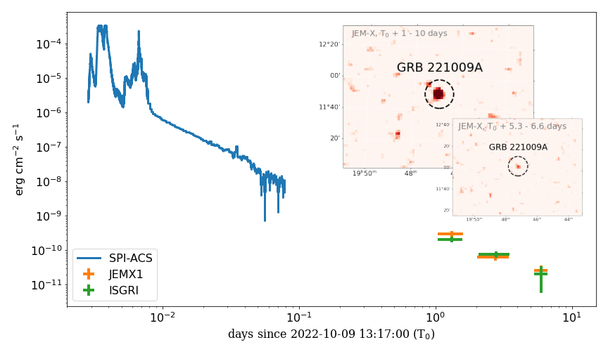

# INTEGRAL sees once in half a millenium Gamma Ray Burst

An exceptionally luminous and nearby (z=0.151) Gamma-Ray Burst, GRB 221009A, was observed on the 9th of October 2022 by INTEGRAL, as well as numerous other space and ground telescopes. It was estimated ([GCN #32793](https://gcn.gsfc.nasa.gov/gcn/gcn3/32793.gcn3))  that such an event only occurs once in half a millenium, and the chance of it happening in INTEGRAL lifetime was only about 3%. 
The capacity of INTEGRAL for nearly continuous all-sky monitoring ensured that it would not miss this once in a lifetime event. This capacity is also crucial for the forthcoming LIGO/Virgo/Kagra 04 run.

Luminous GRBs sometimes reveal a prolonged bright hard X-ray and gamma-ray afterglow, and for a previous GRB INTEGRAL detected it up to few hours after the event (see GRB 120711A, [Martin-Carillo+ 2012](https://www.aanda.org/articles/aa/abs/2014/07/aa20872-12/aa20872-12.html)). INTEGRAL was well prepared to search for this emission in new bright events, and owing to fast follow-up strategy recently optimized for multi-messenger transient counterpart searches, the observation of GRB 221009A started only a few hours after our request, managing to catch an early bright afterglow.

The intensity of the GRB was so high, that its afterglow was detected in INTEGRAL/JEM-X almost during a week, far exceeding the previous record of a few hours. Long-lasting afterglows can also appear without prompt GRB detection in case the collimated source (jet) is not pointing straight to us (as it was also the case in GW170817). However it can be detected at a later stage when the jet decelerates and its opening angle widens. In the future, hard X-ray follow-ups of rapidly expanding population of Gravitational Waves (GW) sources will possibly reveal these so-called "orphan afterglows", providing precise localizations for sources located at distances which will be probed by the GW detectors in the coming years (z<~0.1).

The image shows GRB 221009A lightcurve recorded by several INTEGRAL instruments in days since 2022-10-09 13:17:00. On the left - the prompt emission phase as measured by SPI-ACS, showing the brightest part of the GRB and an extended tail lasting few hours, detected even by a non-imaging detector. On the right - three revolutions of ISGRI and JEM-X observations of the hard X-ray afterglow. For the last point, only JEM-X yields a significant detection. Larger inset shows combined JEM-X image for the entire observation (1 to 10 days since the event). Smaller inset shows the last observation with significant detection (5.3 to 6.6 days since T0).

Credits: 
* V.Savchenko et al 2022, [ATel #15663](https://www.astronomerstelegram.org/?read=15663) 
* Special thank you to ESA Ground Segment Team for rapid scheduling of the follow-up.

[![CC BY 4.0][cc-by-shield]][cc-by]

[cc-by]: http://creativecommons.org/licenses/by/4.0/
[cc-by-image]: https://i.creativecommons.org/l/by/4.0/88x31.png
[cc-by-shield]: https://img.shields.io/badge/License-CC%20BY%204.0-lightgrey.svg
